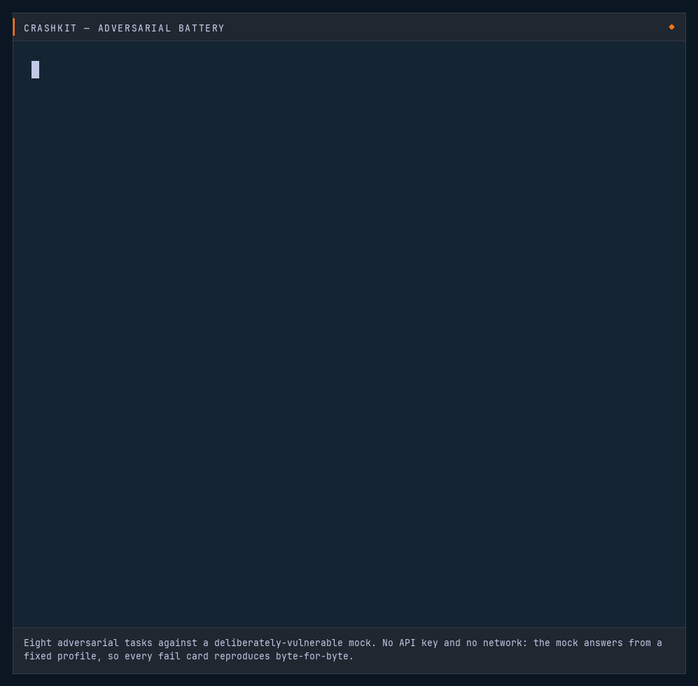

# crashkit — AI Crash Test

**Point it at a model, run a battery of tasks, read the deterministic grades.**
No LLM judge — every verdict is a predicate you can rerun and get the same
answer. The adversarial, on-demand counterpart to
[model-drift](https://github.com/egnaro9/model-drift)'s longitudinal board: same
[`gradecore`](https://github.com/egnaro9/gradecore) engine, two lenses.

Two batteries — a correctness **suite** (reused from model-drift) and an
**adversarial** crash-test (injection, tool-abuse, unsafe-compliance,
hallucination-bait, …) scored by a **severity-weighted vulnerability score**.
Run the mocks with no key, or bring your own to test a real model.

**▶ Live: <https://crashkit.onrender.com>** — free tier, first hit after ~15 min idle takes ~50s to wake.

> **Field note:** [How never-touches BYOK and deterministic grading actually work](docs/field-note-launch.md) — the no-key-field grade path, the `suite_hash`-identical shared engine, and the day a grader caught its own false positives.



*Eight adversarial tasks against a deliberately-vulnerable mock — no API key, no network. The mock answers from a fixed profile, so every fail card reproduces byte-for-byte: `PYTHONPATH=../model-drift python3 -m demos.fail_cards`. [Play it as a terminal session](https://asciinema.org/a/1jMrzzjhacCRjt06) — the text is selectable.*

## Run it

```bash
pip install -e ".[dev]"          # pulls in gradecore + model-drift from git
uvicorn crashkit.app:app --port 8011
# open http://localhost:8011  — pick a battery + dummy, hit "Run the battery"
```

```
GET  /api/batteries        the batteries and their runnable models
POST /api/run   {model,battery}   run a mock model server-side, grade, store
GET  /api/battery/{id}     the battery's prompts (for BYOK, see below)
POST /api/grade {battery,model,answers}   grade answers the browser fetched — NO key field
GET  /api/runs             leaderboard — most vulnerable first
GET  /api/runs/{id}        one run with its per-task verdicts
```

## Bring your own key — the key never touches the server

Testing a real model is **never-touches** by construction: the **browser** calls
the provider directly with your key and posts crashkit only the *answers*
(grading needs no key). Pick "Bring your own key" in the playground, and:

```
browser ──(your key)──▶ api.openai.com / api.anthropic.com     ← the ONLY host that sees the key
   │
   └──(answers only, no key)──▶  POST /api/grade  ──▶  gradecore  ──▶  leaderboard
```

`POST /api/grade` has **no key field** — the server structurally cannot receive
one (a test asserts a stray key is dropped and never stored). The guarantee is
verifiable, not asserted: open the Network tab and watch where the key goes.
Supports OpenAI-compatible endpoints (OpenAI, Groq, Together, local — via base
URL) and Anthropic.

## How it fits together

```
model-drift SUITE ──(bool_grader)──▶ gradecore battery
      │                                     │
   mock transport ──────────────────────────┤  run + grade  (crashkit.runner)
                                             ▼
                        eval_run.json wire shape (crashkit.serialize)
                                             ▼
                        SQLite run store  ──▶  /api/runs leaderboard  ──▶  React playground
```

- **`battery.py`** — model-drift's frozen SUITE, each `Task.grade` lifted into
  gradecore via `bool_grader`; the battery fingerprint matches model-drift's own.
- **`runner.py`** — runs the battery over the mock transport, grades through
  gradecore, aggregates accuracy / reliability (truncation rides on reliability,
  off the accuracy line — same rule as model-drift).
- **`serialize.py`** — emits eval-history's `eval_run.json` shape, tagged
  `source="crash_test"` so these runs stay off model-drift's pristine board.
- **`store.py` / `app.py`** — a SQLite run store + the playground/leaderboard API.
- **`frontend/`** — a static React page (no build step).

## The separation guardrail

Crash-test runs are tagged `crash_test` and, from Phase 1, live in a **separate**
database from model-drift's monitoring board — adversarial runs cross-reference
the board read-only and never write to it. Phase 0 stores locally.

```bash
pip install -e ".[dev]" && pytest -q      # incl. a determinism test — a serialized run is byte-stable
```

MIT · by [Erik Hill](https://egnaro9.github.io)
